# 贺伯AI实战笔记 (herbert-ai-website)

## 项目愿景

个人品牌网站，展示 AI 编程实战内容、工具库、AI 绘图作品与晨间日记。已从 GitHub Pages + Express 架构迁移至 Vercel + Turso (libSQL) 无服务器架构，版本 2.0.0。

## 架构总览

- **前端**：纯 HTML/CSS/JS（无构建步骤、无框架），深色主题 + Glassmorphism 风格
- **后端**：7 个 Vercel Serverless Functions (Node.js ESM)，通过 `vercel.json` rewrites 做路由映射
- **数据库**：Turso (libSQL) 云端 SQLite，7 张表
- **认证**：JWT (jose) + httpOnly Cookie + bcryptjs 密码哈希 + IP 限流
- **部署**：Vercel（`vercel dev` 本地开发，`vercel` 部署）

### 技术栈

| 层 | 技术 | 版本/说明 |
|---|---|---|
| 前端 | Vanilla HTML/CSS/JS | 无框架，纯静态 |
| API | Vercel Serverless Functions | Node.js ESM，每函数 maxDuration=10s |
| 数据库 | Turso (libSQL) | @libsql/client ^0.14.0 |
| 认证 | JWT + bcrypt | jose ^5.9.0, bcryptjs ^2.4.3 |
| 部署 | Vercel | 无构建命令，outputDirectory="." |

### 环境变量

| 变量 | 用途 |
|---|---|
| `TURSO_DATABASE_URL` | Turso 数据库连接 URL |
| `TURSO_AUTH_TOKEN` | Turso 认证令牌 |
| `JWT_SECRET` | JWT 签名密钥 |

## 模块结构图

```mermaid
graph TD
    ROOT["herbert-ai-website (根)"] --> API["api/"]
    ROOT --> LIB["lib/"]
    ROOT --> ADMIN["admin/"]
    ROOT --> SCRIPTS["scripts/"]
    ROOT --> TOOLS["tools/"]
    ROOT --> ASSETS["assets/"]
    ROOT --> PAGES["静态页面 (*.html)"]

    API --> AUTH_API["auth.js"]
    API --> BLOG_API["blog.js"]
    API --> TOOLS_API["tools.js"]
    API --> GALLERY_API["gallery.js"]
    API --> WORKS_API["works.js"]
    API --> JOURNAL_API["journal.js"]
    API --> JSETTINGS_API["journal-settings.js"]

    LIB --> DB_LIB["db.js"]
    LIB --> AUTH_LIB["auth.js"]
    LIB --> RESP_LIB["response.js"]
    LIB --> TRANS_LIB["transformers.js"]

    ADMIN --> ADMIN_PUB["public/ (管理面板)"]
    ADMIN --> ADMIN_DATA["legacy data (*.js)"]

    click API "./api/CLAUDE.md" "查看 API 模块文档"
    click LIB "./lib/CLAUDE.md" "查看 Lib 模块文档"
    click ADMIN "./admin/CLAUDE.md" "查看 Admin 模块文档"
    click SCRIPTS "./scripts/CLAUDE.md" "查看 Scripts 模块文档"
    click TOOLS "./tools/CLAUDE.md" "查看 Tools 模块文档"
```



## 模块索引

| 模块路径 | 职责 | 语言 | 文件数 | 测试 |
|---|---|---|---|---|
| `api/` | Vercel Serverless API 端点（CRUD + 认证） | JS (ESM) | 7 | 无 |
| `lib/` | 共享工具库（DB 连接、JWT 认证、响应、数据转换） | JS (ESM) | 4 | 无 |
| `admin/` | 管理后台面板 + 迁移前遗留数据文件 | HTML/CSS/JS | 11 | 无 |
| `scripts/` | 数据库初始化与数据迁移脚本 | JS (ESM) | 2 | 无 |
| `tools/` | 22+ 独立工具/游戏子页面 | HTML/CSS/JS | ~32 | 无 |
| `assets/` | 图片与静态资源（二进制） | - | ~28 | - |

## 运行与开发

```bash
# 安装依赖
npm install

# 本地开发（需配置 .env.local）
npm run dev          # 等同于 vercel dev

# 数据库初始化（首次部署）
npm run setup-db     # 创建所有表结构

# 数据迁移（从旧 JS 数据文件迁移到 Turso）
npm run migrate      # 读取 admin/*.js 数据文件写入 Turso
```

### .env.local 模板

```
TURSO_DATABASE_URL=libsql://your-db.turso.io
TURSO_AUTH_TOKEN=your-token
JWT_SECRET=your-secret-at-least-32-chars
```

## 测试策略

当前项目无自动化测试。所有 API 端点可通过 `vercel dev` 启动后手动测试。

建议优先补充：
1. `lib/` 单元测试（transformers.js 的转换逻辑、auth.js 的 JWT 流程）
2. `api/` 集成测试（各端点的 CRUD + 权限校验）

## 编码规范

- **模块系统**：ESM (`"type": "module"` in package.json)，所有导入使用 `import/export`
- **API 模式**：每个 `api/*.js` 导出 `default async function handler(req, res)`，通过 `req.query` 参数分发动作
- **数据转换**：DB 使用 snake_case，API 响应使用 camelCase，通过 `lib/transformers.js` 中的 `xxxFromDb` / `xxxToDb` 函数转换
- **认证保护**：所有写操作调用 `requireAuth(req, res)` 校验 JWT；GET 请求通常公开
- **错误处理**：统一使用 `lib/response.js` 的 `json()` 和 `error()` 函数
- **ID 生成**：`{resource}-{Date.now()}` 格式，如 `blog-1717000000000`

## AI 使用指引

- 修改 API 端点时，同步检查 `vercel.json` 的 rewrites 配置是否匹配
- 新增数据表时，需同时更新 `scripts/setup-db.js` 的 SCHEMA 数组和 `lib/transformers.js` 的转换函数
- `admin/public/script.js` 是超大单文件（~100KB），修改时注意定位到正确的功能区域
- `tools/` 下的工具页面大多是独立的单文件 HTML，修改一个不影响其他
- `tools/snake-game/` 有独立的 Netlify 后端，不属于主站 Vercel 架构

## 变更记录 (Changelog)

### 2026-02-26 - 初始架构文档生成
- 由 init-architect 工作流自动生成根级与模块级 CLAUDE.md
- 生成 `.claude/index.json` 索引文件
- 覆盖率：核心模块 (api, lib, scripts) 100%，工具页面部分扫描
