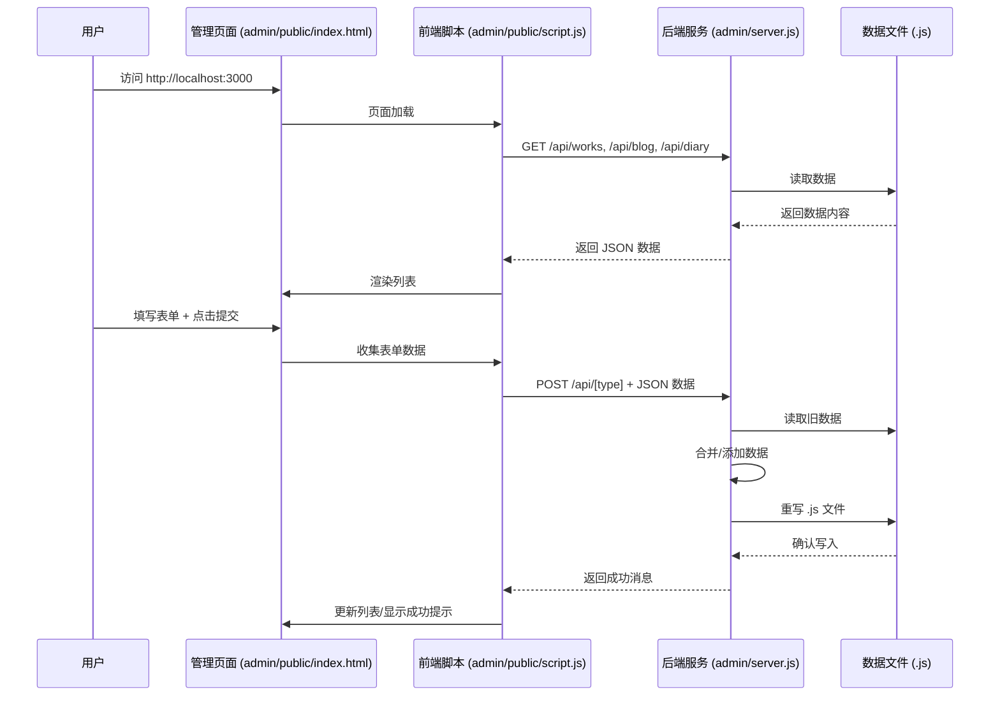

# 个人网站内容管理工具开发计划

## 1. 概述

为个人网站 ([`personal-website`](personal-website/)) 创建一个基于 Web 的内容管理工具，方便更新“精选作品”、“博客文章”和“学习日记”部分。该工具将包含一个前端管理界面和一个本地 Node.js 后端服务，实现直接修改网站的 `.js` 数据文件。

## 2. 需求确认

*   **管理内容:** 精选作品、博客文章、学习日记。
*   **学习日记数据结构:** 包含标题 (`title`)、内容概要 (`summary`)、相关链接 (`link`)。
*   **更新机制:** 使用本地 Node.js 后端服务直接读写 `.js` 数据文件。

## 3. 详细计划

### 3.1. 项目结构与新文件

*   在 [`personal-website`](personal-website/) 目录下创建 `admin` 文件夹。
*   在 `admin` 文件夹内创建 `public` 文件夹。
*   **后端服务:** [`personal-website/admin/server.js`](personal-website/admin/server.js)
*   **管理页面:** [`personal-website/admin/public/index.html`](personal-website/admin/public/index.html)
*   **管理页面脚本:** [`personal-website/admin/public/script.js`](personal-website/admin/public/script.js)
*   **管理页面样式 (可选):** [`personal-website/admin/public/style.css`](personal-website/admin/public/style.css)
*   **学习日记数据:** [`personal-website/learning-diary-data.js`](personal-website/learning-diary-data.js) (初始: `const learningDiaryData = [];`)
*   **学习日记生成脚本:** [`personal-website/generate-learning-diary.js`](personal-website/generate-learning-diary.js)

### 3.2. 后端服务 (`server.js`)

*   **技术栈:** Node.js + Express.js
*   **依赖:** `express`, `cors` (`npm install express cors` in `personal-website/admin`)
*   **功能:**
    *   启动本地 HTTP 服务器 (e.g., port 3000)。
    *   使用 `cors` 中间件。
    *   提供 API Endpoints:
        *   `GET /api/works`: 读取 [`../featured-works-data.js`](personal-website/featured-works-data.js:0)，返回 `featuredWorksData` JSON。
        *   `POST /api/works`: 接收新作品 JSON，添加到数组，重写 [`../featured-works-data.js`](personal-website/featured-works-data.js:0)。
        *   `GET /api/blog`: 类似处理 [`../blog-data.js`](personal-website/blog-data.js:0)。
        *   `POST /api/blog`: 类似处理 [`../blog-data.js`](personal-website/blog-data.js:0)。
        *   `GET /api/diary`: 类似处理 [`../learning-diary-data.js`](personal-website/learning-diary-data.js:0)。
        *   `POST /api/diary`: 类似处理 [`../learning-diary-data.js`](personal-website/learning-diary-data.js:0)。
    *   **数据处理:** 读取 `.js` 文件字符串 -> 解析数组 -> 修改数组 -> 格式化回 `.js` 字符串 -> 写入文件。

### 3.3. 前端管理页面 (`admin/public/index.html` & `script.js`)

*   **HTML (`index.html`):**
    *   标题。
    *   三个区域 (精选作品, 博客, 学习日记)。
    *   每个区域包含: 现有条目列表, 添加/编辑表单, 提交按钮。
*   **JavaScript (`script.js`):**
    *   加载时 `GET` 数据并渲染列表。
    *   处理表单提交: 收集数据 -> `POST` 到后端 -> 根据响应更新 UI。
    *   (可选) 实现编辑功能。

### 3.4. 学习日记展示

*   **HTML:** 在 [`index.html`](personal-website/index.html:0) 添加容器 (e.g., `<div id="learning-diary-list"></div>`)。
*   **JS (`generate-learning-diary.js`):** 类似现有生成脚本，读取 `learningDiaryData` 并渲染到 `#learning-diary-list`。
*   **引入:** 在 [`index.html`](personal-website/index.html:0) 引入 `learning-diary-data.js` 和 `generate-learning-diary.js`。

## 4. 工作流程图

### 4.1. 整体交互



### 4.2. 后端数据更新逻辑

```mermaid
graph TD
    A[接收 POST /api/type 请求] --> B(读取对应 ../type-data.js);
    B --> C(解析JS文件内容, 提取数组);
    C --> D(将新数据加入数组);
    D --> E(格式化为 'const varName = [...] ;');
    E --> F(重写 ../type-data.js);
    F --> G(返回成功);
    B -- 读取失败 --> H(返回错误);
    C -- 解析失败 --> H;
    F -- 写入失败 --> H;
```

## 5. 下一步

切换到“代码”模式开始实施此计划。