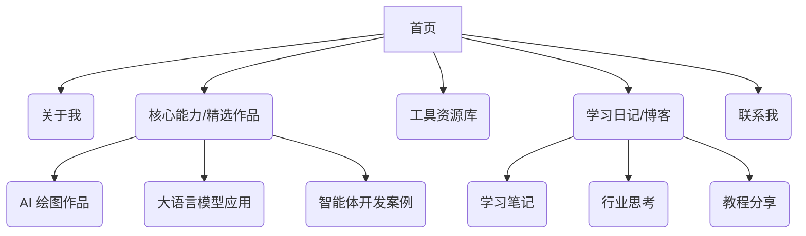

# 个人网站规划文档 - 贺伯谈AI

## 1. 网站目标

*   **核心目标:** 打造个人 AI 领域 IP，展示 AI 相关技能与作品，分享学习历程，吸引潜在合作与交流机会。
*   **目标受众:** 对 AI 技术（绘图、视频、编程、智能体等）感兴趣的个人、潜在客户、同行交流者。
*   **网站调性:** 专业、前沿、真诚、持续学习。

## 2. 网站结构 (改版建议)

*   **首页 (Home):**
    *   **强化 Hero 区:**
        *   保持核心价值主张：“探索 AI 无限可能，记录转型与成长”。
        *   **新增:** 更具视觉吸引力的背景或设计元素。
        *   **新增:** 一个主要的行动号召 (CTA) 按钮，例如“了解我的 AI 探索”或“查看精选作品”，链接到核心板块。
    *   **核心能力/精选作品 (Featured Works - 新增/整合):**
        *   **目的:** 取代或整合“最新动态”，集中展示最具代表性的 AI 技能和项目成果。
        *   **形式:** 采用类似参考网站 `https://idoxu.com/` 的卡片式布局，图文并茂。
        *   **内容:** 每个卡片包含标题、简述、视觉元素（截图/缩略图）、使用的关键技术、(可选)指向详情页或博客文章的链接。分类可参考 Mermaid 图（绘图、LLM 应用、智能体）。
    *   **工具资源库入口:** 简要介绍并提供入口链接。
    *   **关于我摘要:** 简短介绍，引导至“关于我”页面。
    *   **学习日记/博客摘要:** 展示最新几篇精华文章标题/摘要，引导至完整页面。
*   **关于我 (About - 优化):**
    *   **提升为独立重要板块:** 给予更显著的导航入口和页面空间。
    *   **丰富内容:** 详细讲述从工厂转型 AI 的故事、学习理念、对 AI 的愿景。
    *   **增加个人照片:** 提升真实感和亲和力。
    *   **新增 CTA:** 添加明确的行动号召，如“查看我的学习历程” (链接到博客) 或“保持联系” (链接到联系方式)。
*   **AI 作品集 (Portfolio/AI Works - 整合思路):**
    *   核心成果在首页“核心能力/精选作品”板块突出展示。
    *   可以创建一个独立的“作品集”页面，更全面地分类归档所有作品（绘图、视频、编程项目等），包含更详细的描述和技术细节。首页的精选作品卡片可链接至此。
*   **工具资源库 (Tool Library - 优化视觉):**
    *   **保持结构:** 维持现有的分类卡片式布局。
    *   **提升视觉:** 借鉴参考网站的图标风格、卡片间距、排版细节，使其更专业、更符合整体新风格。
    *   **内容关联:** 思考是否可以更突出与你核心 AI 方向相关的自研工具。
*   **学习日记/博客 (Blog/Journal - 整合内容):**
    *   **整合来源:** 将当前的“学习笔记” (`#notes`) 内容移至此页面。
    *   **内容规划:** 系统发布学习笔记、项目复盘、行业思考、实用教程等。可按分类或标签组织。
    *   **价值:** 持续输出，展现专业成长，吸引同好。
*   **联系我 (Contact/Connect - 简化):**
    *   **位置:** 通常置于页脚或独立页面。
    *   **简化:** 考虑移除联系表单（参考 `idoxu.com`），重点突出邮箱地址。
    *   **未来扩展:** 可预留位置添加社交媒体链接（小红书、公众号等）。

## 3. 设计风格建议 (参考 https://idoxu.com/)

*   **核心原则:** 简洁、专业、现代、信息结构清晰、引导性强。
*   **布局与排版:**
    *   **分区明确:** 使用清晰的区块划分不同内容区域，可借鉴参考网站的全宽背景分区。
    *   **卡片式设计:** 大量运用卡片来组织“精选作品”、“工具资源库”等内容，保持视觉一致性。
    *   **留白:** 合理运用留白，避免信息拥挤，提升阅读舒适度和专业感。
    *   **对齐与间距:** 确保元素对齐规整，间距统一，提升视觉精致度。
    *   **响应式:** 必须确保在不同设备（桌面、平板、手机）上都有良好的浏览体验。
*   **色彩搭配:**
    *   **主色调:** 建议采用专业、科技感的色调，如深蓝、深灰、白色作为基础色。
    *   **强调色:** 选择明亮、饱和度适中的颜色（如参考网站使用的蓝色或青色）作为链接、按钮、图标等交互元素的强调色，起到视觉引导作用。
    *   **一致性:** 全站色彩应用保持一致。
*   **视觉元素:**
    *   **图标:** 在“工具资源库”等地方使用简洁、表意明确的图标，风格统一。
    *   **图片/作品展示:** 确保图片质量高，作品截图清晰，展示效果专业。
    *   **按钮/链接:** 设计清晰的按钮样式和链接状态（默认、悬停、点击），引导用户交互。参考 `idoxu.com` 的带箭头链接样式。
*   **字体:**
    *   选择 1-2 种清晰易读的现代无衬线字体（例如：思源黑体、阿里巴巴普惠体、或系统默认字体）。
    *   注意字号、字重、行高的搭配，确保良好的阅读层次和体验。
*   **交互细节:**
    *   借鉴参考网站的链接悬停效果、按钮点击反馈等细微交互，提升用户体验。

## 4. 后续步骤 (本规划任务范围外)

1.  **内容准备:** 收集整理文字、图片、视频等素材。
2.  **技术选型:** 确定网站使用的技术栈（例如：静态网站生成器、博客平台、定制开发等）。
3.  **设计与开发:** 进行 UI/UX 设计和前端/后端开发。
4.  **部署上线:** 将网站部署到服务器或托管平台。
5.  **持续更新:** 定期更新作品、日记和内容。

---