# CyberSnake 开发计划

**项目名称:** CyberSnake

**目标:** 创建一个具有赛博朋克风格（霓虹灯光、暗色调）的贪食蛇游戏，支持桌面键盘和移动端滑动操作，并包含未来科技感的音效。

**技术栈:** HTML, CSS, JavaScript

**1. 项目结构规划:**

我们将采用以下文件结构，存放于 `project11` 目录下：

```mermaid
graph TD
    A[project11] --> B(index.html);
    A --> C(style.css);
    A --> D(script.js);
    A --> E(assets);
    E --> F(audio);
    F --> G(move.wav);  // 蛇移动音效 (可选)
    F --> H(eat.wav);   // 吃食物音效
    F --> I(gameover.wav); // 游戏结束音效
    E --> J(images);  // 可选，用于背景或特殊视觉元素
```

*   [`index.html`](./index.html): 游戏的主体结构和画布。
*   [`style.css`](./style.css): 定义游戏的视觉风格，包括赛博朋克元素和响应式布局。
*   [`script.js`](./script.js): 实现游戏的所有逻辑，包括控制、状态管理和音效。
*   `assets/audio/`: 存放音效文件。
*   `assets/images/`: （可选）存放背景图片或其他视觉资源。

**2. 开发步骤与内容:**

```mermaid
graph LR
    subgraph "阶段一: 基础框架 (Foundation)"
        direction LR
        A[1. 创建文件结构] --> B(2. 编写 HTML 骨架);
        B --> C(3. 设置基础 CSS 样式);
    end
    subgraph "阶段二: 核心游戏逻辑 (Core Logic)"
        direction LR
        C --> D(4. 初始化 Canvas);
        D --> E(5. 定义蛇和食物对象);
        E --> F(6. 实现游戏主循环);
        F --> G(7. 绘制游戏元素);
        G --> H(8. 实现蛇的移动);
        H --> I(9. 实现吃食物逻辑);
        I --> J(10. 实现碰撞检测);
    end
    subgraph "阶段三: 控制与交互 (Controls & Interaction)"
        direction LR
        J --> K(11. 添加桌面键盘控制);
        K --> L(12. 添加移动端滑动控制);
        L --> M(13. 实现游戏状态管理 - 开始/结束);
    end
    subgraph "阶段四: 风格与音效 (Style & Sound)"
        direction LR
        M --> N(14. 应用赛博朋克 CSS 细节 - 霓虹/暗调);
        N --> O(15. 寻找并集成音效);
    end
    subgraph "阶段五: 测试与完善 (Testing & Polish)"
        direction LR
        O --> P(16. 响应式布局测试);
        P --> Q(17. 跨浏览器/设备测试);
        Q --> R(18. 性能优化与调整);
        R --> S(完成!);
    end
```



**详细说明:**

*   **阶段一:** 搭建项目基础，创建必要的文件和目录，编写基础的 HTML 结构（包含 `<canvas>` 和得分显示区域），以及设置页面的基本暗色调背景和布局。
*   **阶段二:** 实现游戏的核心玩法。这包括在 JavaScript 中设置画布、定义蛇和食物的数据结构、创建游戏循环来不断更新和绘制游戏状态、实现蛇的移动算法、处理蛇吃到食物后的增长和得分逻辑，以及检测蛇是否碰到边界或自身。
*   **阶段三:** 添加用户交互。实现通过键盘方向键控制蛇的移动，并添加对移动设备触摸滑动事件的监听，以实现滑动控制。同时，管理游戏的不同状态，如开始界面、游戏进行中和游戏结束界面。
*   **阶段四:** 聚焦于风格和氛围。使用 CSS 精心调整颜色（霓虹色）、字体（如果找到合适的）和效果（如辉光）来营造赛博朋克风格。寻找或生成合适的未来科技感音效，并在 JavaScript 中集成，使其在特定事件（如吃食物、游戏结束）时播放。
*   **阶段五:** 进行全面的测试和优化。确保游戏在不同尺寸的屏幕（桌面、平板、手机）上都能良好显示和操作。在多种浏览器上进行测试，修复兼容性问题。根据测试反馈调整游戏速度、难度等参数，并优化代码性能。

**3. 关于音效:**

我会在开发过程中寻找一些符合“未来科技感”的免费音效资源作为占位符。如果您后续有特定的音效文件，我们可以轻松替换。